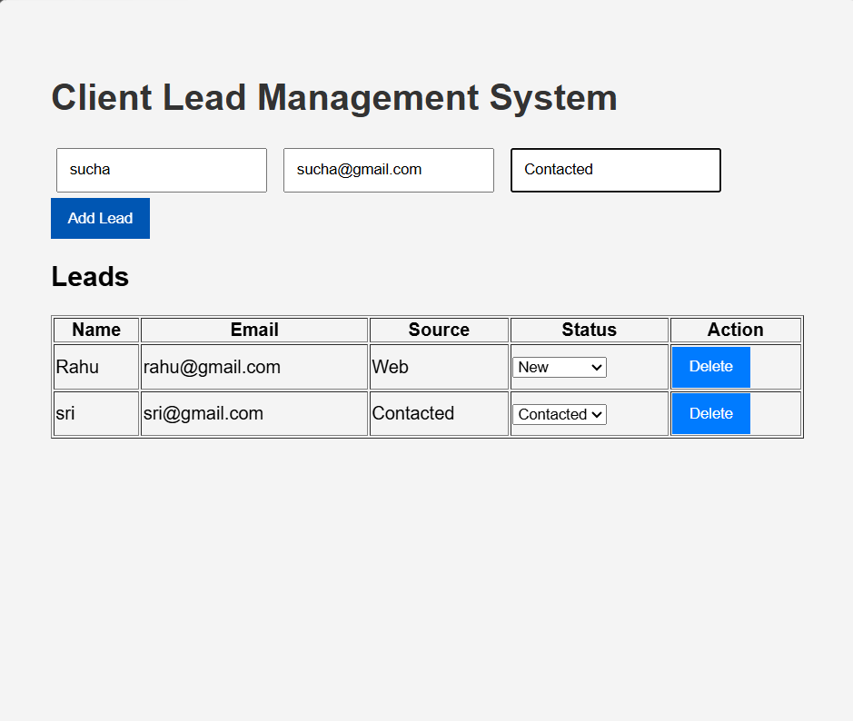
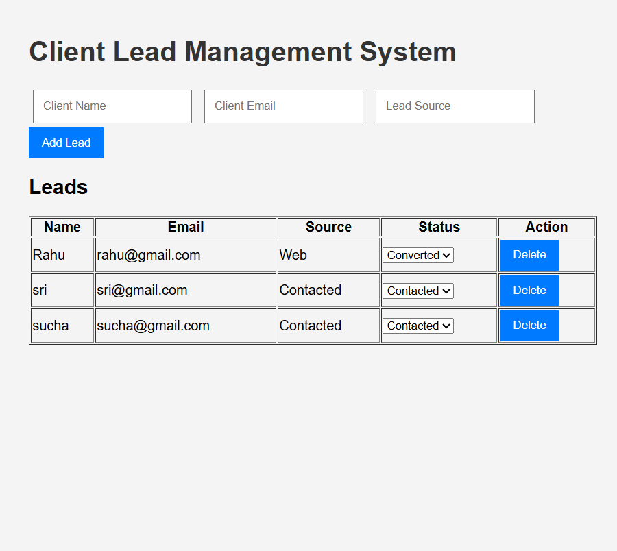
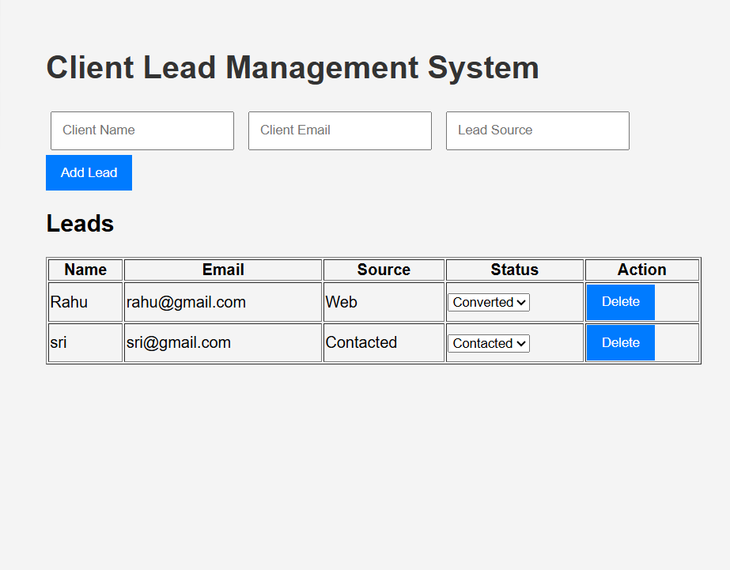

# Client Lead Management System (Mini CRM)

Future Interns Task 2

Tech Stack:
HTML
CSS
JavaScript
Node.js
Express
MongoDB

Features:
- Add leads
- View leads
- Update lead status
- Store leads in database

## Project Screenshots

### Dashboard

### Add Lead Form

### Status Update

### Delete Lead
